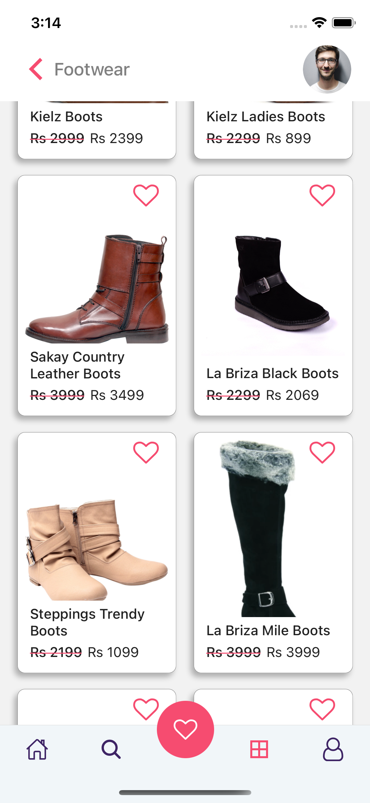

<p align="center">
  <a>
    
  </a>
  <h1 align="center">EcoShop - React Native</h1>  
</p>

---

## Introduction

**EcoShop** is an ecommerce app made with react native using serverless function and realm database.

---

## :sparkles: Main Features

- Authentication.
- Add items to your whishlist
- Search Products
- Infinite list (Pagination)
- Sort with category

### Android

You can download the latest APK [here](https://drive.google.com/drive/folders/1W-pR8CvG8rH6bBaObC1DVyB873w9JXcz?usp=sharinggit).

### IOS

Please clone the repo 🙃🙃🙃

## :camera_flash: Screenshots

<div align="center" style="margin:auto;width:100%;display:flex;justify-content:center;align-items:center;flex-wrap:wrap;">



</div>

## Development

```js bash
# Dependencies
yarn install
or
npm install

##Firebase
Setup Realm Account
Import the ecoshop.csv file in mongo db atlas
Setup Schema and Permissions
Write the serverless functions and fetch the products

# Run IOS
yarn ios

# Run ANDROID
yarn android

```

## Serverless functions used

# addFavourite

```js
exports = function (id, val, isFav) {
  var collection = context.services
    .get('mongodb-atlas')
    .db('EcoShop')
    .collection('UserDB');
  if (isFav)
    return collection.updateOne(
      {_id: BSON.ObjectId(id)},
      {$pull: {favourite: val}},
    );
  else
    return collection.updateOne(
      {_id: BSON.ObjectId(id)},
      {$push: {favourite: val}},
    );
};
```

# getAllProducts

```js
exports = function (arg = 1) {
  var collection = context.services
    .get('mongodb-atlas')
    .db('EcoShop')
    .collection('Flipkart');
  const data = collection
    .find({})
    .skip(arg * 20)
    .limit(20)
    .toArray();
  return {data: data, pgNo: arg + 1};
};
```

# getCategory

```js
exports = function (arg) {
  var collection = context.services
    .get('mongodb-atlas')
    .db('EcoShop')
    .collection('Flipkart');
  return collection.distinct('product_category_tree');
};
```

# getOneProduct

```js
exports = function (arg) {
  var collection = context.services
    .get('mongodb-atlas')
    .db('EcoShop')
    .collection('Flipkart');
  return collection.findOne({_id: BSON.ObjectId(arg)});
};
```

# getProductsWithCategory

```js
exports = function (arg, pgNo) {
  var collection = context.services
    .get('mongodb-atlas')
    .db('EcoShop')
    .collection('Flipkart');
  const data = collection
    .find({product_category_tree: {$regex: arg, $options: 'i'}})
    .skip(pgNo * 20)
    .limit(20)
    .toArray();
  return {data: data, pgNo: pgNo + 1};
};
```

# getProductsWithQuery

```js
exports = function (arg, pgNo) {
  var collection = context.services
    .get('mongodb-atlas')
    .db('EcoShop')
    .collection('Flipkart');
  const data = collection
    .find({product_name: {$regex: arg, $options: 'i'}})
    .skip(pgNo * 20)
    .limit(20)
    .toArray();
  return {data: data, pgNo: pgNo + 1};
};
```

# signInUser

```js
exports = function (arg1, arg2) {
  const collection = context.services
    .get('mongodb-atlas')
    .db('EcoShop')
    .collection('UserDB');
  const data = collection.findOne({email: arg1, password: arg2});
  return data;
};
```

# SignUpUser

```js
exports = async function (item) {
  const collection = context.services
    .get('mongodb-atlas')
    .db('EcoShop')
    .collection('UserDB');
  return collection
    .find({$or: [{username: item.username}, {email: item.email}]})
    .toArray()
    .then(result => {
      if (result.length == 0)
        return collection.insertOne({
          username: item.username,
          password: item.password,
          email: item.email,
          favourite: [],
        });
      else return null;
    });
};
```
